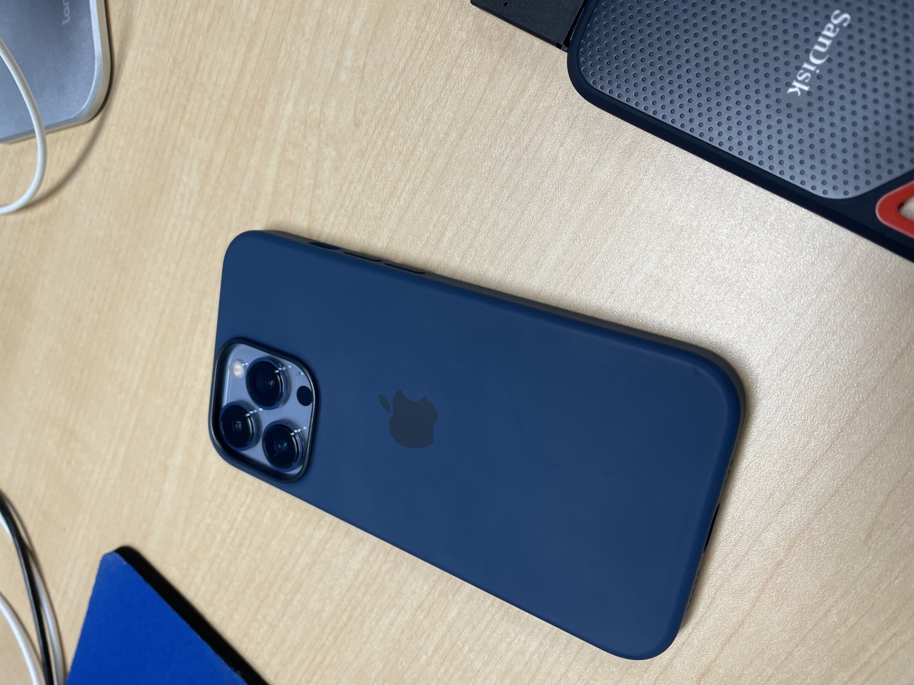
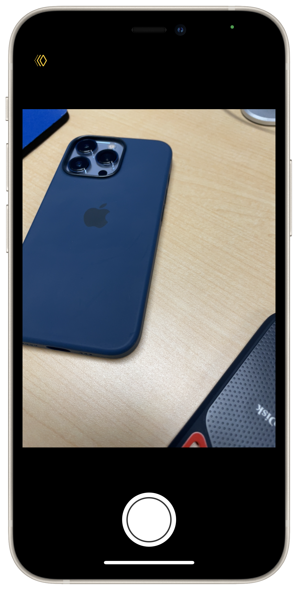

# DualDepth

DualDepth can obtain a depth map from dual camera on your iPhone.

    
    

  

This app is based on [Effortless SwiftUI-- Camera](https://github.com/rorodriguez116/SwiftCamera).

⚠️ If you take a picture **too close** to the object, you may not get a depth map.

## Requirements
- iOS 15.4+
- Xcode 13+
